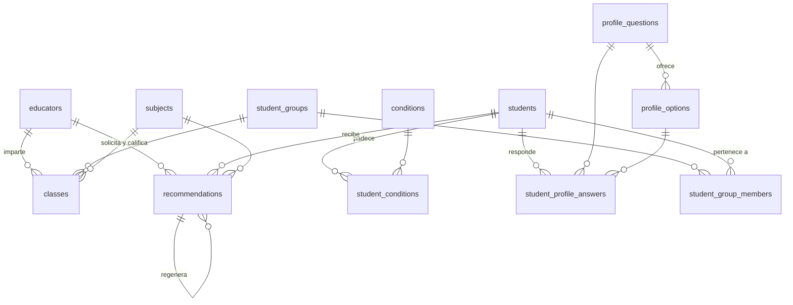

# EduCAM — Esquema de base de datos

Postgres sobre Supabase. Una sola escuela (CAM), alumnos de 3.º a 6.º de primaria.

El sistema gira alrededor de una idea: un educador pide una **recomendación** para
saber cómo impartir un **tema** a un **alumno** concreto, y el modelo Gemma la genera
cruzando cuatro señales — perfil de aprendizaje, padecimientos, grado y materia.
El educador califica el resultado, y esa calificación retroalimenta al modelo.

---

## Diagrama



`educators.id` es al mismo tiempo FK a `auth.users(id)` — no aparece en el diagrama
porque `auth` es un esquema que administra Supabase, no nosotros.

---

## Tablas

### `educators` — quién usa la herramienta

| Campo | Tipo | Notas |
|---|---|---|
| `id` | uuid PK | **Es el mismo id de `auth.users`.** No se genera aquí. |
| `name` | text | |
| `role` | text | `'educator'` \| `'coordinator'`. El coordinador administra grupos y catálogos. |
| `active` | boolean | Baja lógica: un educador inactivo no pasa el RLS. |
| `created_at` | timestamptz | |

> **Email y contraseña NO viven aquí.** Los administra `auth.users` (Supabase Auth).
> Duplicarlos crearía dos fuentes de verdad y un riesgo de seguridad. Para leer el
> email de un educador se hace join contra `auth.users` desde el servidor.

### `students` — alumnos del CAM

| Campo | Tipo | Notas |
|---|---|---|
| `id` | uuid PK | |
| `name` | text | |
| `grade` | smallint | `check between 3 and 6` — el CAM solo atiende ese rango. |
| `age_range` | text | `'7-9'` \| `'10-12'` \| `'12+'`. Rango, no fecha de nacimiento. |
| `profile_comment` | text | Campo libre al final del formulario de perfil. |
| `active` | boolean | |
| `created_at` | timestamptz | |

> No guardamos fecha de nacimiento: el sistema nunca necesita la edad exacta, solo
> el rango, y menos dato personal de un menor es mejor dato personal de un menor.

### `conditions` + `student_conditions` — padecimientos

Catálogo compartido y su relación N:M con el alumno. **Un alumno puede tener n
padecimientos**, por eso es tabla puente y no una columna.

| `conditions` | Tipo | Notas |
|---|---|---|
| `id` | uuid PK | |
| `name` | text UNIQUE | |
| `description` | text | |

| `student_conditions` | Tipo | Notas |
|---|---|---|
| `student_id` | uuid | PK compuesta con `condition_id` |
| `condition_id` | uuid | |
| `notes` | text | Observación del educador sobre *este* alumno con *este* padecimiento. |

### `profile_questions` + `profile_options` + `student_profile_answers` — perfil de aprendizaje

El formulario de opción múltiple. Es **independiente del padecimiento**: describe
qué le impide al alumno comprender o aplicar un conocimiento, no su diagnóstico.

| `profile_questions` | Tipo | Notas |
|---|---|---|
| `id` | uuid PK | |
| `question` | text | El texto que ve el educador. También va al prompt de Gemma. |
| `help_text` | text | Aclaración opcional bajo la pregunta. |
| `sort_order` | smallint | Orden en el formulario. |
| `active` | boolean | Retirar una pregunta sin borrar las respuestas históricas. |

| `profile_options` | Tipo | Notas |
|---|---|---|
| `id` | uuid PK | |
| `question_id` | uuid | Las opciones cuelgan de su pregunta. |
| `label` | text | |
| `sort_order` | smallint | |

| `student_profile_answers` | Tipo | Notas |
|---|---|---|
| `student_id` | uuid | PK compuesta con `question_id` → **una respuesta por pregunta**. |
| `question_id` | uuid | |
| `option_id` | uuid | La opción elegida. |
| `updated_at` | timestamptz | |

> **Ojo con el FK compuesto.** `student_profile_answers` referencia
> `profile_options (id, question_id)`, no solo `id`. Sin eso, un bug de UI podría
> guardar una opción que pertenece a *otra* pregunta: la base lo aceptaría, el
> formulario se vería bien, y Gemma recibiría un perfil incoherente sin que nadie
> se entere. Es la clase de bug que no revienta, solo degrada las recomendaciones.

### `subjects` — materias (tema + categoría + grado)

| Campo | Tipo | Notas |
|---|---|---|
| `id` | uuid PK | |
| `category` | text | `'Matemáticas'`, `'Lenguaje'`… |
| `topic` | text | El tema concreto que se imparte. |
| `grade` | smallint | 3–6. El mismo tema en otro grado es otra fila. |

Único por `(category, topic, grade)`.

### `student_groups` + `student_group_members` + `classes` — operación escolar

| `student_groups` | Tipo | Notas |
|---|---|---|
| `id` | uuid PK | |
| `name` | text | |
| `grade` | smallint | |
| `school_year` | text | `'2025-2026'`. Único junto con `name`. |

| `student_group_members` | Tipo | Notas |
|---|---|---|
| `group_id`, `student_id` | uuid | PK compuesta. Lista de alumnos del grupo. |

| `classes` | Tipo | Notas |
|---|---|---|
| `id` | uuid PK | |
| `group_id` | uuid | |
| `subject_id` | uuid | Único junto con `group_id`: una materia se imparte una vez por grupo. |
| `educator_id` | uuid | Quién la imparte. |

`classes` es la relación ternaria **educador × materia × grupo**. Es lo que permite
la navegación real de la app: *mis clases → grupo → alumnos → pedir recomendación*.

### `recommendations` — la salida del modelo y su feedback

| Campo | Tipo | Notas |
|---|---|---|
| `id` | uuid PK | |
| `student_id` | uuid | |
| `subject_id` | uuid | |
| `educator_id` | uuid | Quién la pidió (y quién la califica). |
| `content` | text | El texto generado por Gemma. |
| `context` | jsonb | **Snapshot** del perfil + padecimientos + grado usados al generarla. |
| `model` | text | `'gemma-3-27b-it'`. Para comparar versiones del modelo. |
| `rating` | text | `'good'` \| `'bad'`, o `NULL` si aún no se califica. |
| `comment` | text | Por qué el educador la calificó así. |
| `rated_at` | timestamptz | |
| `regenerated_from` | uuid | Auto-FK: apunta a la recomendación que el educador rechazó. |
| `created_at` | timestamptz | |

> **`context` es lo que hace que el feedback sirva de algo.** El perfil de un alumno
> cambia con el tiempo. Sin el snapshot, dentro de un mes tendrías una recomendación
> marcada como buena pero no sabrías con qué información se generó — inútil como
> ejemplo few-shot. Con él, el índice parcial sobre `rating = 'good'` te entrega
> directamente los ejemplos por materia para inyectar en el siguiente prompt.

> **`regenerated_from` es el "requirió generar una nueva".** Encadena rechazo →
> reemplazo, así el modelo puede ver ambos y aprender la diferencia.

---

## Cómo se arma una recomendación

Lo que la Edge Function consulta antes de llamar a Gemma:

```sql
-- perfil (pregunta → respuesta elegida)
select q.question, o.label
  from student_profile_answers a
  join profile_questions q on q.id = a.question_id
  join profile_options   o on o.id = a.option_id
 where a.student_id = $1
 order by q.sort_order;

-- padecimientos
select c.name, sc.notes
  from student_conditions sc
  join conditions c on c.id = sc.condition_id
 where sc.student_id = $1;

-- comentario libre, grado y rango de edad
select grade, age_range, profile_comment from students where id = $1;

-- ejemplos: recomendaciones bien calificadas de la misma materia
select content, context from recommendations
 where subject_id = $2 and rating = 'good'
 order by rated_at desc limit 3;
```

> **El peso mayor del perfil sobre el padecimiento no está en el esquema.** La base
> guarda ambos por igual; la jerarquía la impone el prompt de la Edge Function.
> Convertirlo en una columna de peso sería una constante disfrazada de configuración.

---

## Seguridad (RLS)

Manejamos **datos de salud de menores de edad**. RLS no es opcional aquí, y la
`service_role key` no puede salir del servidor bajo ninguna circunstancia.

```sql
create function is_active_educator() returns boolean
language sql stable security definer set search_path = '' as $$
  select exists (select 1 from public.educators
                 where id = auth.uid() and active)
$$;

alter table students enable row level security;
create policy students_educators on students for all to authenticated
  using (is_active_educator());
```

Mismo patrón para `student_conditions`, `student_profile_answers`, `student_groups`,
`student_group_members`, `classes` y `recommendations`.

Los catálogos (`conditions`, `subjects`, `profile_questions`, `profile_options`) son
`select` para `authenticated` y escritura solo desde el servidor.

Como el sistema atiende un solo CAM, todo educador activo ve a todos los alumnos.
La política sigue existiendo porque es lo que bloquea al rol `anon` — cualquiera con
la `anon key` (que es pública, va en el bundle del frontend) llegaría a la base sin ella.

---

## DDL completo

Copiable tal cual en el **SQL Editor** de Supabase.

```sql
-- ── Educators (login) ─────────────────────────────────────
create table educators (
  id          uuid primary key references auth.users(id) on delete cascade,
  name        text not null,
  role        text not null default 'educator'
              check (role in ('educator','coordinator')),
  active      boolean not null default true,
  created_at  timestamptz not null default now()
);

-- ── Students ──────────────────────────────────────────────
create table students (
  id               uuid primary key default gen_random_uuid(),
  name             text not null,
  grade            smallint not null check (grade between 3 and 6),
  age_range        text not null check (age_range in ('7-9','10-12','12+')),
  profile_comment  text,
  active           boolean not null default true,
  created_at       timestamptz not null default now()
);

-- ── Conditions ────────────────────────────────────────────
create table conditions (
  id           uuid primary key default gen_random_uuid(),
  name         text not null unique,
  description  text
);

create table student_conditions (
  student_id    uuid references students on delete cascade,
  condition_id  uuid references conditions,
  notes         text,
  primary key (student_id, condition_id)
);

-- ── Learning profile (multiple-choice form) ───────────────
create table profile_questions (
  id          uuid primary key default gen_random_uuid(),
  question    text not null,
  help_text   text,
  sort_order  smallint not null,
  active      boolean not null default true
);

create table profile_options (
  id           uuid primary key default gen_random_uuid(),
  question_id  uuid not null references profile_questions on delete cascade,
  label        text not null,
  sort_order   smallint not null,
  unique (id, question_id)                     -- soporta el FK compuesto de abajo
);
create index on profile_options (question_id);

create table student_profile_answers (
  student_id   uuid references students on delete cascade,
  question_id  uuid not null,
  option_id    uuid not null,
  updated_at   timestamptz not null default now(),
  primary key (student_id, question_id),       -- una respuesta por pregunta
  foreign key (question_id) references profile_questions,
  foreign key (option_id, question_id)         -- la opción debe ser de esa pregunta
    references profile_options (id, question_id)
);

-- ── Subjects ──────────────────────────────────────────────
create table subjects (
  id        uuid primary key default gen_random_uuid(),
  category  text not null,
  topic     text not null,
  grade     smallint not null check (grade between 3 and 6),
  unique (category, topic, grade)
);

-- ── Groups and classes ────────────────────────────────────
create table student_groups (
  id           uuid primary key default gen_random_uuid(),
  name         text not null,
  grade        smallint not null check (grade between 3 and 6),
  school_year  text not null,
  unique (name, school_year)
);

create table student_group_members (
  group_id    uuid references student_groups on delete cascade,
  student_id  uuid references students on delete cascade,
  primary key (group_id, student_id)
);

create table classes (
  id           uuid primary key default gen_random_uuid(),
  group_id     uuid not null references student_groups on delete cascade,
  subject_id   uuid not null references subjects,
  educator_id  uuid not null references educators,
  unique (group_id, subject_id)
);

-- ── Recommendations ───────────────────────────────────────
create table recommendations (
  id                uuid primary key default gen_random_uuid(),
  student_id        uuid not null references students on delete cascade,
  subject_id        uuid not null references subjects,
  educator_id       uuid not null references educators,
  content           text not null,
  context           jsonb not null,
  model             text not null,
  rating            text check (rating in ('good','bad')),
  comment           text,
  rated_at          timestamptz,
  regenerated_from  uuid references recommendations(id),
  created_at        timestamptz not null default now(),
  check ((rating is null) = (rated_at is null))
);
create index on recommendations (student_id, subject_id, created_at desc);
create index on recommendations (subject_id) where rating = 'good';

-- ── RLS ───────────────────────────────────────────────────
create function is_active_educator() returns boolean
language sql stable security definer set search_path = '' as $$
  select exists (select 1 from public.educators
                 where id = auth.uid() and active)
$$;

alter table educators               enable row level security;
alter table students                enable row level security;
alter table student_conditions      enable row level security;
alter table student_profile_answers enable row level security;
alter table student_groups          enable row level security;
alter table student_group_members   enable row level security;
alter table classes                 enable row level security;
alter table recommendations         enable row level security;

create policy educators_rw   on educators               for all to authenticated using (is_active_educator());
create policy students_rw    on students                for all to authenticated using (is_active_educator());
create policy conds_rw       on student_conditions      for all to authenticated using (is_active_educator());
create policy answers_rw     on student_profile_answers for all to authenticated using (is_active_educator());
create policy groups_rw      on student_groups          for all to authenticated using (is_active_educator());
create policy members_rw     on student_group_members   for all to authenticated using (is_active_educator());
create policy classes_rw     on classes                 for all to authenticated using (is_active_educator());
create policy recs_rw        on recommendations         for all to authenticated using (is_active_educator());

-- Catálogos: lectura para el cliente, escritura solo desde el servidor.
alter table conditions        enable row level security;
alter table subjects          enable row level security;
alter table profile_questions enable row level security;
alter table profile_options   enable row level security;

create policy conditions_read on conditions        for select to authenticated using (true);
create policy subjects_read   on subjects          for select to authenticated using (true);
create policy questions_read  on profile_questions for select to authenticated using (true);
create policy options_read    on profile_options   for select to authenticated using (true);
```

---

## Cómo aplicarlo

1. Crear el proyecto en [supabase.com](https://supabase.com) (región `us-east` o la más cercana).
2. **SQL Editor → New query** → pegar el DDL completo de arriba → **Run**.
3. Cargar los catálogos (`conditions`, `subjects`, `profile_questions`, `profile_options`)
   — sin ellos no hay formulario ni materias que elegir.
4. Compartir con el equipo `NEXT_PUBLIC_SUPABASE_URL` y `NEXT_PUBLIC_SUPABASE_ANON_KEY`
   (Settings → API). **La `service_role key` no se comparte por chat ni se commitea:**
   se configura como secret de la Edge Function.

---

## Supuestos abiertos

Decisiones tomadas por default que conviene confirmar antes de meterle datos reales:

- **Una respuesta por pregunta** en el formulario. Si alguna debe permitir varias
  selecciones, la PK de `student_profile_answers` pasa a `(student_id, option_id)`.
- **`grade` vive en el alumno**, no hay historial por ciclo escolar. Al cambiar de
  año se actualiza a mano.
- **El perfil no versiona.** Al re-llenar el formulario se sobrescribe la respuesta;
  el histórico queda solo dentro del `context` de cada recomendación.
- **Todo educador activo ve a todos los alumnos.** Si cada quien debe ver únicamente
  a los alumnos de sus clases, la policy pasa por `classes` + `student_group_members`.
- **Sin auditoría de accesos.** Son datos de salud de menores; si el CAM lo exige,
  hace falta una tabla de log.
